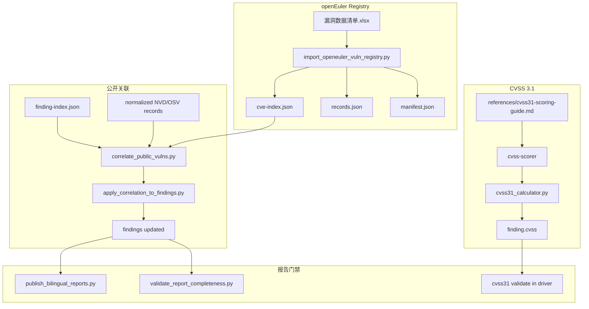

# CVSS 3.1 与 openEuler CVE 注册表设计

**状态：** 已批准 — 已实施  
**日期：** 2026-06-30  
**版本基线：** `0.10.0-alpha11`（`skill.json` / `core/manifest.yaml` 已对齐）  
**关联文档：**
- 实施计划：[`docs/superpowers/plans/2026-06-30-cvss31-openeuler-registry.md`](../plans/2026-06-30-cvss31-openeuler-registry.md)
- Cursor plan：`.cursor/plans/cvss31_与欧拉_cve_库_f92ecdbe.plan.md`
- Finding 披露层级：[`core/disclosure/finding-levels.md`](../../core/disclosure/finding-levels.md)
- Agent 加载层级：[`core/disclosure/load-tiers.md`](../../core/disclosure/load-tiers.md)
- 渐进式披露 workflow：[`workflows/09-progressive-disclosure.md`](../../workflows/09-progressive-disclosure.md)
- 公开关联策略：[`references/public-vulnerability-correlation-policy.md`](../../references/public-vulnerability-correlation-policy.md)
- 公开关联 runbook：[`docs/runbooks/public-vulnerability-correlation.md`](../runbooks/public-vulnerability-correlation.md)

---

## 1. 目的与边界

### 1.1 目的

1. **CVSS 默认切换为 v3.1**：新增 stdlib 计算器，对齐 [sh1yan.top/cvssjs](https://sh1yan.top/cvssjs/) 与 FIRST CVSS v3.1 规范；agent 产出向量后必须经计算器校验。
2. **openEuler CVE 注册表**：从 `漏洞数据清单.xlsx` sheet2/3/4 导出可检索 JSON，以 **CVE 精确匹配** 补充 Validated Finding 的公开披露判定。
3. **端到端门禁闭环**：correlation 结果回写 finding，使 `validate_report_completeness.py` 可通过。

### 1.2 已确认策略（用户批准）

| 决策 | 选择 |
|------|------|
| 注册表匹配模式 | CVE 精确匹配；无 CVE 时仍走 NVD/OSV 模糊关联 |
| JSON 是否提交仓库 | 是；xlsx 仅作更新源（`.gitignore` 保留 `*.xlsx`） |
| M3 证据（registry 命中） | CVE 精确命中已配置 `openEuler-Registry` 且 finding 可提取同一 CVE → M3 |
| 欧拉 `category` | 仅报告备注；不影响 `publicly_disclosed` 判定（三类 sheet 均为已知公开 CVE） |

### 1.3 明确跳过

- sheet1（开源组件漏洞数量排名）、sheet5（iso列表）导入
- 包名/组件名无 CVE 时的注册表模糊匹配
- openpyxl / pandas 等第三方依赖
- CVSS v4.0 作为默认（schema enum 保留 `4.0` 仅兼容旧产物）

---

## 2. 现状与缺口（Review 结论）

### 2.1 CVSS

- 文档/agent 默认 **CVSS v4.0**；无机械式评分工具。
- `cvss-scorer` 子 agent 手工产出 vector/score，无法验证一致性。

### 2.2 公开 CVE 关联

- `correlate_public_vulns.py` 只写 `public-vuln-correlation.json`，**不回写 finding**。
- `validate_report_completeness.py` 检查 finding 上的 `disclosure_status` 与 `public_vulnerability_references`；`unknown` 或 `publicly_disclosed` 无 refs → fail。
- `finding.schema.json` **无 `cve` 字段**；CVE 须从 `public_vulnerability_references` 或文本字段正则提取。
- 现行 M3 规则要求 package + file/function 等多维证据；纯 CVE registry 命中需新增 **M3-CVE** 路径（见 §4.3）。

### 2.3 xlsx 数据结构（实测）

| Sheet | 名称 | 约行数 | 结构注意 |
|-------|------|--------|----------|
| 2 | 欧拉不受影响漏洞 | ~9685 | row1 标题，row2 表头；大量 hidden 行；E 列 VLOOKUP 公式常 `#N/A` |
| 3 | 欧拉挂起漏洞 | ~772 | 6 列：序号、CVE编号、风险等级、扩展列、软件包名、组件位置 |
| 4 | 欧拉已修复漏洞 | ~3259 | row1 杂项，row2 表头，row3+ 数据 |

表头列（sheet2/4）：`CVE编号`、`风险等级`、`修复情况`、`软件包名`、`组件位置`  
数据统计截止：`2026-06-24`（sharedStrings 首行）

---

## 3. 架构



---

## 4. Part A — CVSS 3.1

### 4.1 计算器 `tools/cvss31_calculator.py`

**职责：** 解析 CVSS:3.1 向量，计算 Base Score 与 severity；校验已有 CVSS artifact。

**输入：**
- `--vector 'CVSS:3.1/AV:N/AC:L/PR:N/UI:N/S:U/C:H/I:H/A:H'`
- `--validate --in <cvss.json|finding.json>`（读取 `cvss.vector` / `base_score` / `severity`）

**输出（JSON）：**
```json
{
  "version": "3.1",
  "vector": "CVSS:3.1/AV:N/AC:L/PR:N/UI:N/S:U/C:H/I:H/A:H",
  "base_score": 9.8,
  "severity": "Critical"
}
```

**算法：** FIRST CVSS v3.1 Base Score（Scope Changed / Unchanged 分支）。golden cases 与 [cvssjs](https://sh1yan.top/cvssjs/) 对齐。

**严重度映射：** 0→None；0.1–3.9→Low；4.0–6.9→Medium；7.0–8.9→High；9.0–10.0→Critical

**约束：** stdlib only；非法向量 fail-closed（非零 exit）。

### 4.2 评分指南 `references/cvss31-scoring-guide.md`

- 默认 `CVSS:3.1/` 前缀；8 个 Base Metric 中文说明（对齐 cvssjs 选项标签）
- Likely → `status: provisional`；Validated → `status: final`
- `rationale` 须覆盖每个非默认 metric
- **不得以** openEuler 清单中的 `risk_level`（高危/中危/严重）替代 CVSS 向量

### 4.3 Agent 与 workflow

- `cvss-scorer`：产出 vector + rationale；**禁止手算分数**；须调用 `cvss31_calculator.py --validate`
- `workflows/07-cvss-scoring.md`：明确 calculator 为必接步骤
- driver：findings 校验阶段调用 calculator（A5 由「可选」提升为**必做**）

### 4.4 Schema 与 fixture

- `schemas/cvss.schema.json`：保留 `"4.0"` enum；新产物默认 `"3.1"`；可选 `vector` pattern `^CVSS:3\.1/`
- 更新 `sample-cvss.json`、`sample-finding.json`、`sample-report.json` 及所有引用 `CVSS:4.0` 的测试

### 4.5 文档切换验收

全仓库 `grep -r 'CVSS:4.0\|CVSS v4.0'` 清零（旧 CHANGELOG/RELEASE-NOTES 除外）。

**必改文件清单（补充原 plan 遗漏）：**

| 文件 |
|------|
| `SKILL.md`, `agents/cvss-scorer.md`, `workflows/07-cvss-scoring.md`, `workflows/08-report.md` |
| `adapters/claude-code/agents/cvss-scorer.md`, `adapters/opencode/opencode.json`, `adapters/codex/AGENTS.md` |
| `references/severity-rating.md`, `README.md`, `examples/binutils/finding.example.md` |
| `CLAUDE.md`（若含 CVSS v4.0 引用） |

---

## 5. Part B — openEuler CVE 注册表

### 5.1 文件布局

```
offline-bundle/vuln-db/openeuler/
  README.md           # 更新流程说明
  manifest.json       # last_updated, record_count, data_cutoff, source_file_hash
  cve-index.json      # 轻量检索：CVE → [{category, package, risk_level, ...}]
  records.json        # 完整 records（报告详情 / 审计溯源）
```

**设计理由：** ~1.3 万条完整 provenance 约数 MB；correlate 只加载 `cve-index.json`。

### 5.2 Record 格式

```json
{
  "cve_id": "CVE-2026-48715",
  "category": "unaffected",
  "risk_level": "高危",
  "affected_branches": ["master", "openEuler-24.03-LTS-SP4"],
  "package": "radvd",
  "component_location": "iso",
  "provenance": {
    "source_file": "漏洞数据清单.xlsx",
    "sheet": "欧拉不受影响漏洞",
    "sheet_row": 7,
    "imported_at": "2026-06-30T12:00:00Z"
  }
}
```

- `category` enum：`unaffected` | `suspended` | `fixed`（对应 sheet2/3/4）
- `affected_branches`：**JSON array**（由 xlsx「修复情况」Python list 字符串解析）
- 同一 CVE 多行 → `cve-index` 中值为 array

### 5.3 Schema

新建 `schemas/openeuler-vuln-registry.schema.json`；注册到 `core/manifest.yaml` `registered_schemas`。

### 5.4 导入 `tools/import_openeuler_vuln_registry.py`

**解析：** stdlib `zipfile` + `xml.etree`

**规则：**
- 表头行：扫描首 5 行，找含 `CVE编号` 的行
- 跳过：`hidden="true"` 行、CVE 为空、`#N/A` / `#REF!`、非 `CVE-YYYY-NNNN+` 格式
- sheet2→`unaffected`，sheet3→`suspended`，sheet4→`fixed`
- E 列 VLOOKUP（iso）不可靠时以 D 列软件包名为准
- 输出 `manifest.json` 含 xlsx SHA256 便于更新检测

**测试：**
- CI：`tests/fixtures/sample-openeuler-registry.xlsx`（synthetic mini）
- Integration（`PVAS_RUN_INTEGRATION=1`）：完整 xlsx `record_count > 10000`

### 5.5 CVE 提取 `extract_cve_ids(finding)`

置于 `correlate_public_vulns.py` 或 `pvas_io.py`：

1. `public_vulnerability_references[].id`
2. 正则 `CVE-\d{4}-\d+` 扫描：`title`, `summary`, `root_cause`, `security_impact`, `validation`（JSON 字符串化）

去重、大写规范化。

---

## 6. Part C — 公开关联与回写

### 6.1 `correlate_public_vulns.py` 扩展

**新 CLI：**
- `--openeuler-index offline-bundle/vuln-db/openeuler/cve-index.json`（默认路径）

**流程（每个 Validated finding）：**

```
1. cve_ids = extract_cve_ids(finding)
2. FOR each cve_id IN cve_ids:
     IF cve_id IN openeuler_index:
       → status=publicly_disclosed, match_level=M3
       → matched_records += {source: "openEuler-Registry", id, category, package, ...}
       → match_evidence += ["cve-exact", "openeuler-registry"]
       → STOP (registry 优先)
3. ELSE: 现有 NVD/OSV 模糊评分逻辑不变
4. checked_sources += "openEuler-Registry"
5. 若 NVD 也命中：合并 matched_records，按 CVE ID 去重
```

### 6.2 M3-CVE 策略（更新 policy）

在 `references/public-vulnerability-correlation-policy.md` 与 `AGENTS.md` 增加：

> **M3-CVE：** 在已配置的 `openEuler-Registry` 中 CVE 精确命中，且 finding 中可提取到同一 CVE ID，视为 M3 证据，可标记 `publicly_disclosed`。  
> 清单 `category`（unaffected/suspended/fixed）表示欧拉处置状态，**不**表示 CVE 未公开。  
> **不得**因此升格 `disclosure_level` 或自动生成 D3/D4 材料（见 §7.1）。

### 6.3 回写 `tools/apply_correlation_to_findings.py`（新增，P0）

**职责：** 将 correlation 结果同步到 finding JSON，满足 report gate。

**CLI：**
```bash
python3 tools/apply_correlation_to_findings.py \
  --findings audit-output/05-findings/finding-index.json \
  --correlation audit-output/machine/correlation/public-vuln-correlation.json \
  --out audit-output/05-findings/finding-index.json
```

**逻辑（Validated only）：**
- 从 correlation 读取 `status`, `match_level`, `matched_records`
- 回写 `disclosure_status`
- 若 `publicly_disclosed`：填充 `public_vulnerability_references`（source, id, match_level；url 若有）
- **不得**修改 `disclosure_level`（D2/D3/D4 由 intake / disclosure-coordinator 单独决定，见 §7.1）
- 不覆盖 finding 中已存在且更具体的 refs（合并去重）
- 写 `machine/correlation/apply-correlation-result.json` 审计摘要

**driver 顺序：**
```
correlate_public_vulns.py
  → apply_correlation_to_findings.py
  → publish_bilingual_reports.py
  → validate_report_completeness.py
```

### 6.4 报告增强

bilingual **D2 内部报告**（`06-report`）「公开披露汇总表」增加可选列 **欧拉处置状态**（category 中文：不受影响/挂起/已修复）。分层规则见 §7.3。

### 6.5 Freshness

扩展 `check_offline_db_freshness.py`：
- `--extra-manifest offline-bundle/vuln-db/openeuler/manifest.json`
- 或顶层 manifest 索引 openeuler 子源

---

## 7. 渐进式披露对齐（D-tier / L-tier）

本节将本次新增能力与 PVAS **Finding 披露层级（D0–D4）**、**Agent 加载层级（L0–L4）** 及 [`workflows/09-progressive-disclosure.md`](../../workflows/09-progressive-disclosure.md) 机械绑定。加载层级约束**谁可读**；披露层级约束**结论可写到哪里**。

### 7.1 披露边界：`disclosure_status` ≠ `disclosure_level`

PVAS 中存在两个独立字段，**不得混用或联动升格**：

| 字段 | 含义 | 本次变更是否写入 |
|------|------|----------------|
| `disclosure_status` | 在**已配置公开数据源**中是否匹配到该 CVE/记录（`publicly_disclosed` / `possibly_public` / `not_found_in_configured_sources` / `unknown`） | **是** — correlate + apply |
| `disclosure_level` | Finding **对外披露授权**（D2 内部 / D3 维护者私密 / D4 修复后公开） | **否** — 保持 intake 或 disclosure-coordinator 原值 |

**硬规则（实施必须 enforce）：**

1. openEuler registry 或 NVD/OSV 命中 → **仅**更新 `disclosure_status` 与 `public_vulnerability_references`。
2. **禁止**因 registry 命中自动将 `disclosure_level` 从 `D2-internal-validated` 升为 `D3-maintainer-private` 或 `D4-public-after-fix`。
3. **禁止**因 `disclosure_status=publicly_disclosed` 自动生成 `audit-output/07-disclosure/` 下 maintainer 或 public advisory 草稿；D3/D4 仍须 [`disclosure-coordinator`](../../agents/disclosure-coordinator.md) 在 workflow 09 中**显式授权**后产出。
4. M3-CVE 语义：在已配置 `openEuler-Registry` 中确认 **CVE ID 属于已知公开漏洞集合**；**不等于**已完成 maintainer 协调或允许对外发布审计细节/PoC。

**CVSS 与 D-tier：**

| Finding 状态 | CVSS `status` | 披露层级 | 可出现在 |
|--------------|---------------|----------|----------|
| Likely | `provisional` | D1 | 内部候选列表 only |
| Validated | `final` | D2+ | D2 内部报告；D3/D4 按 `disclosure_level` |

### 7.2 加载层级（L-tier）与 manifest 绑定

Coordinator **仅**读 L0 + L1 摘要；注册表全量 **不得**进入 parent-agent 上下文。

| 产物 | load_tier | disclosure_tier | 读者 | Coordinator |
|------|-----------|-----------------|------|-------------|
| `offline-bundle/vuln-db/openeuler/cve-index.json` | **L4** | —（离线 bundle，非 audit 产物） | `import_openeuler_vuln_registry.py`、`correlate_public_vulns.py` | **禁止** |
| `offline-bundle/vuln-db/openeuler/records.json` | **L4** | — | 导入脚本、按需审计溯源 | **禁止** |
| `offline-bundle/vuln-db/openeuler/manifest.json` | **L1** | — | freshness 摘要、coordinator | 允许（仅 manifest 元数据） |
| `audit-output/machine/correlation/public-vuln-correlation.json` | **L1** | — | coordinator、report-writer | 允许（摘要） |
| `audit-output/machine/correlation/apply-correlation-result.json` | **L1** | — | coordinator | 允许 |
| `audit-output/05-findings/finding-index.json`（回写后） | **L1** | **D2** | coordinator、report-writer | 允许（finding 摘要） |
| `audit-output/05-findings/CVSS-*.json` | **L2** | D2 | cvss-scorer | 否（委派 subagent） |

**`core/manifest.yaml` 实施项：**

1. 在 `l4_forbidden_patterns` 增加：`offline-bundle/vuln-db/openeuler/cve-index.json`、`offline-bundle/vuln-db/openeuler/records.json`（或通配 `offline-bundle/vuln-db/openeuler/*.json`，manifest 除外）。
2. 在 `artifacts` 注册：
   - `public-vuln-correlation` → `audit-output/machine/correlation/public-vuln-correlation.json`，L1
   - `apply-correlation-result` → `audit-output/machine/correlation/apply-correlation-result.json`，L1
3. `context_budget.py` / intake packet 构建时：若 coordinator task packet 含上述 L4 路径 → warn 或 block（与现有 L4 策略一致）。

### 7.3 报告分层（D2 / D3 / D4）

| 内容 | D2 内部报告（`06-report`） | D3 维护者私密（`07-disclosure/.../maintainer-*`） | D4 公开 advisory（`07-disclosure/.../public-advisory-draft`） |
|------|---------------------------|--------------------------------------------------|----------------------------------------------------------------|
| `disclosure_status` / 匹配等级 | 完整 | 完整 | 摘要（CVE ID + 来源，无行级 provenance） |
| 欧拉 `category`（不受影响/挂起/已修复） | **可选列** | 可含（维护者上下文） | **省略**或一句概括 |
| `affected_branches` / registry 行级 provenance | 可含 | 按需 | **禁止** |
| CVSS vector / score / severity | 完整（Validated `final`） | 完整 | score + severity；向量可选 abbreviated |
| PoC 路径 / 复现细节 | 索引路径（D2 本地） | 可含（私密） | **禁止**（workflow 09 既有规则） |
| `public_vulnerability_references` | 完整 | 完整 | 仅公开 CVE/GHSA 链接级引用 |

**workflow 09 衔接：**

- 本次变更归属 **08-report 之前的关联阶段**（machine correlation + finding 回写），不替代 workflow 09。
- `publish_bilingual_reports.py` 写入的 D2 报告可含 §6.4 欧拉处置列；**不得**写入 D4 草稿。
- D4 生成前须确认：`disclosure_level` 含 `D4-public-after-fix` 且 disclosure-coordinator 已授权。

### 7.4 验收（渐进式披露）

实施完成须满足：

1. `apply_correlation_to_findings.py` 单元测试：回写前后 `disclosure_level` 不变。
2. registry 命中后 **不存在** 自动创建的 `07-disclosure/public-advisory-draft.md`（除非 workflow 09 单独触发）。
3. coordinator 默认 task packet 不含 `cve-index.json` / `records.json` 路径。
4. D2 内部报告含欧拉 category 列；D4 模板/示例不含 registry 行级字段。

---

## 8. 测试与门禁

| 测试 | 覆盖 |
|------|------|
| `test_cvss31_calculator.py` | ≥10 golden vectors（含 Scope Changed）；非法向量 fail |
| `test_import_openeuler_vuln_registry.py` | synthetic xlsx；index 构建；branch 解析 |
| `test_public_vuln_correlation.py` | registry CVE 命中 → M3；无 CVE 不触发 |
| `test_apply_correlation_to_findings.py`（新） | 回写 disclosure_status + refs；**不修改 disclosure_level** |
| E2E fixture | correlate → apply → validate_report_completeness 通过 |
| 渐进式披露（§7.4） | L4 路径不进 coordinator packet；无自动 D4 草稿 |

**run-tests.sh：** 注册上述新测试；required files 增加 `offline-bundle/vuln-db/openeuler/manifest.json`。

**REQUIRED_TOOLS 增加：**
- `cvss31_calculator.py`
- `import_openeuler_vuln_registry.py`
- `apply_correlation_to_findings.py`

---

## 9. 版本与变更

- `skill.json` / `core/manifest.yaml`：已为 `0.10.0-alpha11`；实施完成后确认一致
- `CHANGELOG.md`：新增 alpha11 节
  - **Changed:** 默认 CVSS v3.1；cvss31_calculator 必接
  - **Added:** openEuler registry 导入；M3-CVE；apply_correlation_to_findings

---

## 10. 实施顺序

1. 本 spec 批准（含 §7 渐进式披露）
2. A1 + A4 + `test_cvss31_calculator.py`
3. A2 + A3（grep 清零 v4.0）
4. B1 + B2（导入 + 首次 JSON 提交）
5. B3 + apply_correlation + manifest L-tier 绑定（§7.2）
6. B4 + driver 接线 + freshness + D2 报告 category 列（§7.3）
7. A5（CVSS validate 必做）+ policy/AGENTS M3-CVE + CHANGELOG + `./run-tests.sh` 全绿

---

## 11. 约束（不变）

- 注册表命中只标记 `disclosure_status=publicly_disclosed`；**不**升格 `disclosure_level`；禁止「绝对未公开」措辞
- xlsx 不入库；更新：替换 xlsx → `import_openeuler_vuln_registry.py` → 提交 JSON + manifest
- PoC 仅 Validated、本地；D4 公开须 workflow 09 授权；不生成武器化 exploit
- 注册表 JSON 为 L4，coordinator 禁止加载全量 index/records
- stdlib-only
