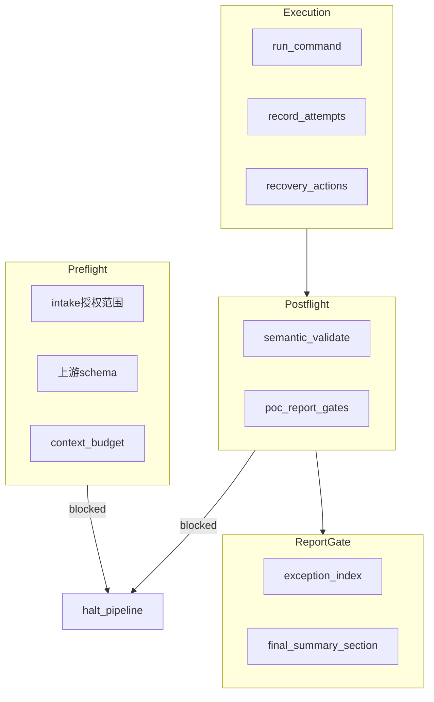

# PVAS 分层架构与 Semgrep 联网策略设计

**日期**：2026-06-30  
**状态**：阶段 1 实现完成（[`2026-06-30-pvas-layered-refactor-phase1.md`](../plans/2026-06-30-pvas-layered-refactor-phase1.md)）  
**范围**：全栈分层重构（core / runtime / guides / adapters）、Agent 加载层级（L0–L4）与 Finding 披露层级（D0–D4）双层 manifest 映射、Semgrep Registry 联网扫描策略、**统一异常处理流程补齐**（继承并扩展 [`2026-06-26-audit-workflow-gates-design.md`](2026-06-26-audit-workflow-gates-design.md)）。

## 1. 背景

`package-vuln-audit-skill`（PVAS）已具备完整的审计流水线：10 个 workflow、`agents/` 角色定义、`tools/` 机械门禁、`schemas/` 契约、`audit-output/` 分阶段产物，以及 Context Budget Guard v2.1 与 D0–D4 渐进式披露策略。

近期已完成一轮冗余简化（`pvas_io`、`report_render`、`strict_env_gate` 等共享模块），但存在结构性问题：

| 问题 | 现状 |
|------|------|
| 目录扁平 | `workflows/`、`agents/`、`tools/` 并列，无强制分层 |
| 披露未机械绑定 | D0–D4 与 L-tier 约束写在 markdown，目录不 enforce |
| Coordinator 污染风险 | 无 manifest 索引，agent 可能误读 L4 原始日志 |
| Semgrep 策略不完整 | matrix 使用 `--config auto`，但 workflow 默认禁止联网，Registry 规则可能拉取失败 |
| 网络门禁分裂 | driver 的 `--allow-network` 仅服务公网漏洞关联，未覆盖 tool-scan |
| 异常处理分裂 | workflow-gates 设计有四类异常 + 四段控制，但 driver 各 stage 策略不一致（fail-open / fail-closed 混用），无统一 `exception-index` |

本设计在**不重建审计语义**的前提下，引入 manifest 驱动的分层架构，并分三阶段交付。

## 2. 已确认决策

1. **架构方案**：Manifest 驱动的分层单体（方案 A），不用 stage 垂直切片或 Python 包化。
2. **重构边界**：全栈分层（core / runtime / guides / adapters），允许调整目录，保留 adapter 安装兼容。
3. **披露落地**：双层映射 — Agent 加载层级 L0–L4 + Finding 披露层级 D0–D4，`core/manifest.yaml` 显式关联。
4. **Semgrep 联网**：显式 `--allow-network` 后使用 Semgrep Registry（`--config auto` / `p/ci` 等）；默认 offline。
5. **交付节奏**：
   - **阶段 1**：manifest + 披露骨架 + **异常模型骨架**（不迁移物理路径）
   - **阶段 2**：迁移 `tools/` → `runtime/`，`workflows/` → `guides/`，**统一 driver gate 策略**
   - **阶段 3**：Semgrep 联网策略、离线规则包与 **Semgrep 专用异常恢复**
6. **异常处理**：继承 workflow-gates 四类异常与 Preflight/Execution/Postflight/Report Gate；在 `core/manifest.yaml` 与 `machine/exception-index.json` 中机械绑定 stage 传播策略。

## 3. 目标架构

### 3.1 分层职责

```text
core/       契约、策略、manifest（零执行副作用）
runtime/    机械执行：lib、gates、stages、driver
guides/     AI 可读 workflow（summary/detail 分离）
agents/     canonical 角色定义
recipes/    L3 按需加载的审计 playbook
adapters/   平台薄包装 + 兼容 shim
```

**依赖方向（单向）：**

```text
adapters → guides/agents → core/manifest
runtime  → core/contracts
runtime  ↛ guides（runtime 不 import markdown）
coordinator ↛ runtime/stages 源码（只读 summary JSON）
```

### 3.2 终态目录结构

```text
package-vuln-audit-skill/
├── SKILL.md                          # L0 入口（路径不变）
├── AGENTS.md                         # L0
│
├── core/
│   ├── manifest.yaml                 # L/D 双层注册表 + stage 索引 + exception_policy
│   ├── state-machine.md              # ← 从 SKILL.md 抽取或引用
│   ├── exceptions/
│   │   ├── exception-model.md        # 四类异常 + 四段控制 + stage 传播规则
│   │   └── stage-policies.yaml       # 每 stage 的 preflight/postflight/gate 清单
│   ├── contracts/schemas/            # ← schemas/ 迁入（含 exception-index.schema.json）
│   ├── policies/                     # ← references/ 迁入
│   └── disclosure/
│       ├── load-tiers.md             # L0–L4 定义
│       └── finding-levels.md         # D0–D4 定义
│
├── runtime/
│   ├── lib/                          # pvas_io, report_render, tool_catalog…
│   ├── gates/                        # strict_env_gate, workflow_contract, validate_manifest, validate_intake, aggregate_exceptions
│   ├── stages/
│   │   ├── 00-environment/
│   │   ├── 01-profile/
│   │   ├── 02-tools/
│   │   │   └── semgrep/              # 阶段 3：strategy + offline rules
│   │   ├── 03-candidates/
│   │   ├── 04-validation/
│   │   ├── 05-findings/
│   │   ├── 06-report/
│   │   └── 07-disclosure/
│   └── driver.py                     # ← enforced_audit_driver.py
│
├── guides/
│   ├── index.json                    # L1：stage 摘要 + manifest 指针
│   ├── 00-intake.summary.md
│   ├── 00-intake.detail.md
│   └── …                             # ← workflows/ 拆分迁入
│
├── agents/                           # canonical（不变）
├── recipes/                          # L3 按需
├── templates/
├── adapters/
│   └── _compat/                      # 旧 tools/*.py 转发（过渡期）
│
├── tests/
└── audit-output/                     # 输出树契约不变
```

### 3.3 双层映射

#### Agent 加载层级（L0–L4）

| 层级 | 内容 | 读者 | Coordinator 可见 |
|------|------|------|------------------|
| L0 | `SKILL.md`、`AGENTS.md` | 所有 agent | 是 |
| L1 | `guides/index.json`、`*-summary.json`、stage 结论 | coordinator | 是 |
| L2 | `guides/*.detail.md`、当前 stage 的 workflow 细节 | 对应 subagent | 否（委派） |
| L3 | `agents/*.md`、选中 `recipes/`、schema 名 | 对应 subagent | 否 |
| L4 | 原始 tool log、全量 source、全部 packet | tool-runner 等 | **禁止** |

#### Finding 披露层级（D0–D4）

| 层级 | 含义 | 典型产物路径 |
|------|------|-------------|
| D0 | Internal Candidate | `audit-output/03-candidates/` |
| D1 | Internal Likely | `03-candidates/ranked-candidates.json`（state=`Likely` 条目，内部列表） |
| D2 | Internal Validated | `05-findings/`、`06-report/` |
| D3 | Maintainer Private | `07-disclosure/zh-CN\|en-US/maintainer-*` |
| D4 | Public After Fix | `07-disclosure/.../public-advisory-draft.md` |

`core/manifest.yaml` 为每个 artifact 声明 `{ load_tier, disclosure_tier, step_id, audit_output_dir, schema, path_pattern }`（`step_id` 为 canonical，见 §3.4）。

### 3.4 Stage 标识对照表（canonical：`driver step_id`）

PVAS 历史上并存三套命名：**workflow 文档序号**（00–09 业务步骤）、**audit-output 目录**（按产物类型）、**driver `step_id`**（机械编排写入 `machine/workflow-steps/`）。本 spec 规定：

- **machine 产物与 `exception-index.events[].step_id` 一律使用 driver `step_id`**
- manifest 每条 stage/artifact 同时声明 `workflow_doc` 与 `audit_output_dir`（可为 null）
- §11.5 及后续实现计划以 `step_id` 为主列；另两列仅供人类对照

| driver `step_id` | workflow 文档 | audit-output 目录 | 编排者 | 说明 |
|------------------|---------------|-------------------|--------|------|
| `00-intake` | `workflows/00-intake.md` | `00-intake/` | driver | scope、授权、网络策略 |
| `00-workflow-contract` | —（横切） | `machine/workflow-contract.json` | driver | manifest/contract 一致性 |
| `00-environment` | （含于 intake / 工具安装） | `00-intake/` | driver | environment-check、install-assistant |
| `01-package-profile` | `workflows/01-package-profile.md` | `01-profile/` | driver | package-profile、context-budget |
| `02-tool-matrix` | （tool-scan 前置） | `02-tools/` | driver | tool-matrix.json |
| `03-tool-scan` | `workflows/03-tool-scan.md` | `02-tools/` | driver | raw 扫描、tool-summary |
| `03-candidate-packets` | `workflows/04-ai-hypothesis.md`（部分） | `03-candidates/` | driver | normalize → rank → packets → budget |
| `04-ai-hypothesis` | `workflows/04-ai-hypothesis.md` | `03-candidates/` | **agent** | A-CAND；driver 不机械执行 |
| `02-scope-selection` | `workflows/02-scope-selection.md` | `01-profile/` 或 scope 字段 | **agent** | recipe/扫描范围；driver 不机械执行 |
| `05-candidate-review` | `workflows/05-candidate-review.md` | `03-candidates/` | **agent** | packet 评审；见 §11.10 |
| `06-validation` | `workflows/06-validation.md` | `04-validation/` | **agent** | validator 子流程 |
| `07-schema-validation` | （findings 门禁） | `machine/schema-validation-result.json` | driver | 仅 `--findings` 路径 |
| `07-manual-validation-plans` | `workflows/06-validation.md` | `04-validation/` | driver | Needs Manual Review 计划 |
| `07-poc-generation` | `workflows/06-validation.md` | `04-validation/poc-tests/` | driver | Validated PoC |
| `07-cvss-scoring` | `workflows/07-cvss-scoring.md` | `05-findings/` | **agent** | CVSS 子流程 |
| `08-fetch-public-sources` | （report 子步骤） | `machine/correlation/` | driver | 可选；需 `--allow-network` |
| `08-report` | `workflows/08-report.md` | `06-report/` | driver | 双语报告、final report |
| `09-artifact-summary` | `workflows/09-progressive-disclosure.md`（部分） | `machine/artifact-summary.json` | driver | 产物索引 |
| `09-disclosure` | `workflows/09-progressive-disclosure.md` | `07-disclosure/` | **agent** | D3/D4 草稿；见 §11.10 |

**Agent 步骤**（表中标注 **agent**）由 coordinator 委派 subagent 完成；异常经 stage 结论 JSON 与 summary 汇总进 `exception-index`（§11.10），不由 driver 直接 `write_step`。

## 4. core/manifest.yaml 设计

### 4.1 顶层结构（终态示例）

```yaml
schema_version: "1.0"
skill_version: "0.11.0"  # 阶段 2 物理迁移完成后 bump；阶段 1 保持 skill.json 当前版本

load_tiers:
  L0: { max_tokens_hint: 8000, readers: [coordinator, all] }
  L1: { max_tokens_hint: 40000, readers: [coordinator] }
  L2: { max_tokens_hint: 80000, readers: [subagent] }
  L3: { max_tokens_hint: 120000, readers: [subagent] }
  L4: { forbidden_for: [coordinator], readers: [tool-runner, result-normalizer] }

disclosure_tiers:
  D0: { reportable: false }
  D1: { reportable: false }
  D2: { reportable: internal }
  D3: { reportable: maintainer }
  D4: { reportable: public_after_fix }

stages:
  - step_id: "00-intake"
    workflow_doc: workflows/00-intake.md          # 阶段 2 改为 guides/00-intake.summary.md
    guide_detail: guides/00-intake.detail.md      # 阶段 2 才有
    audit_output_dir: audit-output/00-intake
    outputs:
      - path: audit-output/00-intake/scope.md
        load_tier: L1
        disclosure_tier: null

artifacts:
  - id: tool-summary
    path_pattern: audit-output/02-tools/tool-summary.json
    load_tier: L1
    schema: tool-summary.schema.json
    step_id: "03-tool-scan"
    audit_output_dir: audit-output/02-tools
    exception_policy:
      on_blocked: halt_pipeline
      on_recoverable: record_and_continue
      emits: [recoverable, blocked, not-applicable]

exception_aggregation:
  index_path: audit-output/machine/exception-index.json
  schema: exception-index.schema.json
  schema_path: schemas/exception-index.schema.json   # 阶段 1；阶段 2 迁至 core/contracts/schemas/
  load_tier: L1
```

### 4.1.1 阶段 1 过渡形态

阶段 1 **不迁移** `schemas/`、`workflows/`，manifest 使用下列约定：

| 字段 | 阶段 1 值 | 阶段 2 值 |
|------|-----------|-----------|
| `workflow_doc` | `workflows/NN-*.md` | `guides/NN-*.summary.md` |
| `guide_detail` | 省略或等于 `workflow_doc` | `guides/NN-*.detail.md` |
| `schema` / `schema_path` | `schemas/*.schema.json` | `core/contracts/schemas/*.schema.json` |
| gate 脚本 | `tools/*.py` | `runtime/gates/*.py` 或 `runtime/stages/*/` |

阶段 1 manifest 示例（intake stage）：

```yaml
stages:
  - step_id: "00-intake"
    workflow_doc: workflows/00-intake.md
    audit_output_dir: audit-output/00-intake
    load_tier_guide: L2
    outputs:
      - path: audit-output/00-intake/scope.md
        load_tier: L1
      - path: audit-output/00-intake/intake.json
        load_tier: L1
        schema: intake.schema.json
        schema_path: schemas/intake.schema.json
```

`templates/` 与 `recipes/` 在 manifest 中注册为 L3 artifact（阶段 1 可仅列路径模式，不拆 summary/detail）。

### 4.2 门禁集成

- `tools/validate_manifest.py`（阶段 1 暂放 `tools/`）：校验 manifest 条目对应的文件/schema 存在；CI 与 driver preflight 调用。
- `tools/validate_intake.py`（阶段 1 暂放 `tools/`）：Preflight 校验 `intake.json` / `scope.md` 授权与范围（**补齐缺口**）。
- `tools/aggregate_exceptions.py`（阶段 1 暂放 `tools/`）：汇总各 stage 异常写入 `exception-index.json`（**补齐缺口**）。
- `enforce_workflow_contract.py` 扩展（阶段 1 **warn**）：manifest 与 `REQUIRED_SCHEMAS` 对齐检查，消除 drift；阶段 2 改为与 validate_manifest **单源 block**。
- `context_budget.py` 扩展：读取 manifest 的 `load_tier`，拒绝 coordinator 任务包含 L4 artifact。
- **driver gate 策略统一**：禁止对 complete-audit 关键 stage 使用 silent `allow_fail=True`（见 §11.6）。

## 5. Semgrep 联网策略（阶段 3）

### 5.1 现状

- `tools/generate_tool_matrix.py`：`semgrep scan --config auto --json`
- `workflows/03-tool-scan.md`：默认 no network
- complete audit：`semgrep` applicability = `mandatory`

### 5.2 目标行为

| network_mode | semgrep config | 行为 |
|--------------|----------------|------|
| `offline`（默认） | `runtime/stages/02-tools/semgrep/rules/baseline/` | 使用 bundled 离线规则；写入 `rules_source: offline-bundle` |
| `online-approved` + `--allow-network` | `auto` 或 profile 选择 `p/ci` | Registry 拉取；写入 `rules_source: semgrep-registry` |
| strict + offline + semgrep mandatory | — | 阻断或需 `PVAS_ALLOW_DEGRADED=1` |

### 5.3 新增字段（tool-summary / matrix）

```json
{
  "name": "semgrep",
  "status": "completed",
  "rules_source": "semgrep-registry",
  "rules_config": "auto",
  "network_used": true
}
```

### 5.4 统一网络门禁

扩展 `enforced_audit_driver` / `run_tools.sh`：

- `--allow-network` 同时授权：Semgrep Registry、公网漏洞 fetch（已有）、install-assistant online-approved（已有策略）
- intake 记录 `network_policy` 与本次实际 `network_used_tools[]`

### 5.5 离线规则包

- 路径：`runtime/stages/02-tools/semgrep/rules/baseline/`
- 来源：Semgrep 官方 rules 子集（security-audit、cwe-top-25 等）定期 sync，hash 记录在 manifest
- 与 `offline-bundle/` 策略一致：hash 校验 + 版本 pin

## 6. 分阶段交付

### 阶段 1：Manifest + 披露骨架（本阶段实施入口）

**目标**：建立注册表与 L/D 定义，**不移动**现有 `tools/`、`workflows/` 物理路径。

| 交付物 | 说明 |
|--------|------|
| `core/manifest.yaml` | 注册现有 schemas、workflows、tools、audit-output 路径；含 `exception_policy` 与 §3.4 三列对照 |
| `core/disclosure/load-tiers.md` | L0–L4 规范 |
| `core/disclosure/finding-levels.md` | D0–D4 规范 |
| `core/exceptions/exception-model.md` | 四类异常、四段控制、stage 传播规则 |
| `core/exceptions/stage-policies.yaml` | 每 `step_id` 的 Preflight/Postflight 必查项（含 §11.2 样例） |
| `schemas/exception-index.schema.json` | 异常汇总 JSON schema（**阶段 1 放 `schemas/`**；阶段 2 迁入 `core/contracts/schemas/`） |
| `guides/index.json` | 从 `workflows/*.md` 生成的 L1 摘要索引 |
| `tools/validate_intake.py` | intake Preflight gate |
| `tools/aggregate_exceptions.py` | 写入 `audit-output/machine/exception-index.json` |
| `tools/validate_manifest.py` | manifest 校验 gate |
| `tools/enforce_workflow_contract.py` 扩展 | manifest ↔ REQUIRED_SCHEMAS 对齐（阶段 1 warn） |
| `tests/test_manifest.py` | manifest 与磁盘一致性测试 |
| `tests/test_exception_index.py` | 异常汇总与 step_id 传播测试 |
| `tests/test_intake_gate.py` | 缺授权/范围 → preflight block |
| `SKILL.md` 更新 | 指向 manifest、L-tier 与 exception-index |

**完成标准：**

- `./run-tests.sh` 通过
- `validate_manifest.py` 在 driver preflight 可选启用（默认 **warn**，阶段 2 改 **block**）
- driver 在 `--findings` 完整审计路径末尾写入 `exception-index.json`（关闭 E1；E11 **machine 侧**汇总）
- `validate_finding_schema` 改为 **fail-closed**（见 §11.6；complete audit 路径强制 jsonschema）
- **不在阶段 1 要求** §11.9 `final-summary-report.md` 异常章节（属 E11 **阶段 2** Report Gate）

### 阶段 2：物理迁移

| 自 | 至 |
|----|-----|
| `schemas/` | `core/contracts/schemas/` |
| `references/` | `core/policies/` |
| `tools/*.py` | `runtime/lib/` + `runtime/stages/*/` |
| `tools/enforced_audit_driver.py` | `runtime/driver.py` |
| `workflows/*.md` | `guides/*.summary.md` + `*.detail.md` |
| `tools/` shell | `runtime/stages/*/scripts/` |

**兼容：**

- `adapters/_compat/` 保留 `tools/<name>.py` 转发至 `runtime/`
- `run-tests.sh` 与 adapter INSTALL 文档同步更新
- 至少保留 1 个版本的 shim

**异常处理补齐（阶段 2）：**

- `runtime/driver.py` 统一 gate 表（§11.5），消除 stage 间 fail-open 不一致
- `run_tool_matrix.py` 实现 matrix 声明的 **timeout** 与 **recovery_action** 全集
- candidate normalize/rank/packets 失败 → `blocked` 或显式 `recoverable`，禁止 silent skip
- Postflight 统一入口：`runtime/gates/run_postflight.py` 按 `stage-policies.yaml` 调度

### 阶段 3：Semgrep 策略

| 交付物 | 说明 |
|--------|------|
| `runtime/stages/02-tools/semgrep/strategy.py` | 按 network_mode + profile 选择 config |
| `runtime/stages/02-tools/semgrep/rules/baseline/` | 离线规则 bundle |
| `generate_tool_matrix.py` 迁移版 | 调用 strategy |
| driver `--allow-network` 扩展 | 统一 tool-scan 网络授权 |
| Semgrep 异常恢复 | 见 §11.7（timeout / offline fallback / split-scope） |
| 测试 | offline/online/strict 三场景 + semgrep 异常路径测试 |

## 7. 模块化原则

| 模块 | 内聚职责 | 对外接口 |
|------|----------|----------|
| `core/manifest` | 注册表、L/D 映射 | YAML + validate CLI |
| `core/contracts` | JSON Schema | schema 文件路径 |
| `runtime/lib` | I/O、渲染、catalog | Python 函数 |
| `runtime/gates` | 门禁 | CLI exit code + JSON |
| `runtime/stages/*` | 单 stage 工具 | CLI |
| `runtime/driver` | 编排 | CLI |
| `guides/*` | AI 指令 | markdown + index.json |
| `adapters/*` | 平台差异 | thin-ref + install |

**禁止：**

- runtime 模块 import guides markdown
- coordinator task packet 包含 L4 artifact 路径（manifest gate 拦截）
- 未授权网络下静默使用 `--config auto`

## 8. 测试策略

| 阶段 | 测试 |
|------|------|
| 1 | `test_manifest.py`：条目存在、L-tier 合法、无 orphan schema |
| 1 | `test_context_budget` 扩展：coordinator 含 L4 路径 → block |
| 1 | `test_exception_index.py`：blocked 传播、recoverable 汇总、`step_id` 与 partial_stages |
| 1 | `test_intake_gate.py`：缺授权/范围 → preflight block |
| 2 | `test_driver_gate_policy.py`：各 stage fail-closed 一致性 + §11.9 final-summary 章节 |
| 2 | `test_tool_timeout_recovery.py`：timeout → recoverable → retry/block |
| 2 | 全量 `run-tests.sh` + adapter install 冒烟 |
| 3 | semgrep offline bundle 扫描 toy project；online mock（或 skip if no network） |

## 9. 风险与缓解

| 风险 | 缓解 |
|------|------|
| adapter 安装路径断裂 | `_compat/` shim + INSTALL 双路径文档 |
| manifest 与代码 drift | CI gate + test_manifest |
| offline semgrep 规则过时 | manifest 记录 rules bundle version + sync 脚本 |
| 阶段 2 大范围移动 | 分 stage 子 PR，每步 run-tests |
| 异常策略回退为 silent fail | `test_driver_gate_policy` + exception-index 必填 |

## 10. 非目标

- 合并 `publish_bilingual_reports` 与 `generate_final_report` 为单一工具
- 引入 pytest 或第三方 Python 依赖
- Semgrep Cloud/App API（需 token 的 D 方案）
- 本阶段修改 `audit-output/` 阶段前缀或 finding state machine 语义

## 11. 统一异常处理流程（补齐）

本节继承 [`2026-06-26-audit-workflow-gates-design.md`](2026-06-26-audit-workflow-gates-design.md) §4–§9，并明确**当前实现缺口**与**分层架构下的补齐方案**。目标：complete audit 的每个 stage 对异常的处理可预测、可审计、可汇总，且 coordinator 仅通过 L1 的 `exception-index.json` 感知异常，不读 L4 原始日志。

### 11.1 四类异常（canonical）

| 类型 | 含义 | 典型场景 | complete audit 最终态 |
|------|------|----------|----------------------|
| `recoverable` | 可重试或经用户/安装助手修复 | 工具 timeout、可安装缺失、临时非零退出 | 必须解析为 `completed` 或 `blocked`，不得停留 |
| `blocked` | 不可安全继续 | semgrep 未成功、Validated 无 PoC、报告完整性失败、intake 不清 | halt pipeline |
| `not-applicable` | 有画像证据的不适用 | npm 对非 Node 项目 | 记录理由，继续 |
| `manual-review` | 证据有价值但无法自动验证 | Needs Manual Review finding | 一等输出，**不得**标为 Validated |

**中间态**（仅 Execution 记录，不得作为 complete audit 最终理由）：

`failed`、`timeout`、`not-installed`、`malformed-output`、`partial-output`

### 11.2 四段控制模型

每个 stage 在 `core/exceptions/stage-policies.yaml` 声明四段检查项；driver 按序执行并写入 `machine/workflow-steps/{step_id}.json`。

**`stage-policies.yaml` 样例（单 step）：**

```yaml
step_id: "03-tool-scan"
audit_output_dir: audit-output/02-tools
preflight:
  - check: upstream_artifact_exists
    path: audit-output/02-tools/tool-matrix.json
  - check: schema_valid
    schema: tool-matrix.schema.json
execution:
  record: tool-execution-attempts.json
  mandatory_tools: [semgrep]
postflight:
  - check: no_mandatory_blocked
    artifact: tool-summary.json
report_gate:
  emit_to: exception-index.json
```

```text
Preflight   → 上游产物、schema、授权/预算、manifest 指针
Execution   → 命令执行 + tool-execution-attempts.json
Postflight  → 语义校验、占位符检测、PoC/报告 gate
Report Gate → 最终 exception-index + final-summary 异常章节
```



### 11.3 现状缺口清单

以下 gap 来自对 [`tools/enforced_audit_driver.py`](../../../tools/enforced_audit_driver.py) 与 workflow-gates 设计的对比；**本 spec 要求分阶段关闭**。

| ID | 缺口 | 设计有 | 实现有 | 关闭阶段 |
|----|------|--------|--------|----------|
| E1 | 统一 `exception-index.json` | 是 | 否 | 1 |
| E2 | Intake Preflight 机械校验 | 是 | 否（仅 workflow 文档） | 1 |
| E3 | manifest `exception_policy` | — | 否 | 1 |
| E4 | schema 校验 fail-open（ImportError→pass） | 否 | 是 | 1 |
| E5 | normalize/rank/packets silent `allow_fail` | 否 | 是 | 2 |
| E6 | 工具 timeout 未 enforced | 是 | 否 | 2 |
| E7 | 恢复动作仅 retry，缺 split-scope/offline rules | 是 | 否 | 2–3 |
| E8 | Postflight 分散、无统一调度 | 是 | 部分 | 2 |
| E9 | Semgrep 专用异常恢复链 | 是 | 否 | 3 |
| E10 | candidate review 产物无 driver gate | 部分 | 否 | 2（可选 warn） |
| E11 | Report Gate 未强制汇总 blocked/recoverable | 是 | 部分 | **1**（machine exception-index）+ **2**（§11.9 final-summary 章节） |

### 11.4 异常汇总产物：`exception-index.json`

**路径：** `audit-output/machine/exception-index.json`  
**Load tier：** L1（coordinator 可读）  
**Schema：** `exception-index.schema.json`（阶段 1 物理路径：`schemas/exception-index.schema.json`）

```json
{
  "generated_at": "2026-06-30T12:00:00Z",
  "pipeline_decision": "continue",
  "summary": {
    "blocked_count": 0,
    "recoverable_count": 1,
    "not_applicable_count": 2,
    "manual_review_count": 3
  },
  "events": [
    {
      "id": "EX-03-tool-scan-semgrep",
      "step_id": "03-tool-scan",
      "audit_output_dir": "02-tools",
      "class": "recoverable",
      "code": "semgrep.timeout",
      "message": "semgrep exceeded 120s; retried with increased timeout",
      "recovery_actions": ["increase-timeout", "retry"],
      "final_decision": "completed",
      "artifact_refs": ["audit-output/02-tools/tool-execution-attempts.json"]
    }
  ],
  "halted_stages": [],
  "partial_stages": ["08-report"]
}
```

`partial_stages` 与 `halted_stages` 内元素均为 **driver `step_id`**（上例 `08-report` 表示 correlation 跳过，非 audit-output 目录名）。

`aggregate_exceptions.py` 在 driver 每个 stage 后增量合并；Report Gate 前做最终 `pipeline_decision` 计算：

- 任一 mandatory stage `blocked` → `pipeline_decision: halt`
- 仅 optional/recoverable 且已解决 → `continue`
- 无 `--public-records` 等已知跳过 → 记入 `partial_stages`，**不**记为 blocked

### 11.5 各 Stage 异常流程（目标态，canonical：`step_id`）

| `step_id` | audit-output | Preflight | Execution 异常 | Postflight | 传播 |
|-----------|--------------|-----------|----------------|------------|------|
| `00-intake` | `00-intake/` | 授权、范围、网络/构建/fuzz 策略 | — | `intake.json` schema | 不清 → **block** |
| `00-workflow-contract` | `machine/` | manifest 指针 | — | contract JSON | fail → **block** |
| `00-environment` | `00-intake/` | profile/mode | install-assistant | `environment-check.json` | strict 缺工具 → **block**；default → recoverable/degraded |
| `01-package-profile` | `01-profile/` | source 存在 | profile 脚本失败 | `package-profile.json` schema | fail → **block** |
| `02-tool-matrix` | `02-tools/` | profile 存在 | — | matrix schema | fail → **block** |
| `03-tool-scan` | `02-tools/` | matrix 存在 | 见 §11.7 semgrep | `tool-summary` 无 mandatory blocked | blocked → **halt** |
| `03-candidate-packets` | `03-candidates/` | tool-summary ok | normalize/rank/packet | context_budget；raw-candidates 非空或显式 empty | silent fail → block/recoverable（阶段 2）；budget `blocked` → **block**；`split-required` → continue + 事件 |
| `07-schema-validation` | `machine/` | `--findings` 提供 | jsonschema | fail-closed | fail → **block** |
| `07-manual-validation-plans` | `04-validation/` | findings 提供 | — | manual plans 存在 | 缺计划 → **block**（Needs Manual Review 路径） |
| `07-poc-generation` | `04-validation/` | Validated 列表 | PoC 生成/执行 | poc validate | PoC fail → **block** |
| `08-fetch-public-sources` | `machine/correlation/` | 网络授权 | fetch | records 格式 | 可选；fail → recoverable 或 partial |
| `08-report` | `06-report/` | correlation 可选 | publish/final | report completeness | fail → **block**；无 `--public-records` → **partial** |
| `09-artifact-summary` | `machine/` | 上游 steps 已写 | summarize | artifact-summary schema | fail → warn + exception 事件 |
| `09-disclosure` | `07-disclosure/` | D3/D4 级别 | — | 敏感字段剥离 | 未授权 → **block** public 草稿（agent；§11.10） |

Agent 步骤（`04-ai-hypothesis`、`02-scope-selection`、`05-candidate-review`、`06-validation`、`07-cvss-scoring`）见 §11.10，不重复列入 driver 表。

### 11.6 Driver Gate 策略统一（关闭 E4/E5）

**原则：** complete audit（提供 `--findings`）对安全/完整性关键路径 **fail-closed**。

| 当前调用 | 现策略 | 目标策略 |
|----------|--------|----------|
| `validate_finding_schema` | ImportError/Exception → pass | **block** + 写入 exception-index |
| `normalize_results.py` | allow_fail | **block** 或 recoverable+重试（阶段 2） |
| `rank_candidates.py` | allow_fail | 同上（阶段 2） |
| `make_ai_packets.py` | allow_fail | 同上（阶段 2） |
| `generate_poc_testcase.py` | allow_fail 后 validate | 生成 fail → **block**（Validated 路径） |
| `generate_final_report.py` | allow_fail | warn + exception 事件；缺 final report → Report Gate **block**（阶段 2） |

**E4 / jsonschema 策略（阶段 1）：**

| 路径 | jsonschema 可用 | 行为 |
|------|-----------------|------|
| complete audit（`--findings`） | 是 | 校验失败 → `blocked`（`EX-SCH-002`） |
| complete audit（`--findings`） | 否（ImportError） | **block**（`EX-SCH-001`）；写入 exception-index；**不** silent pass |
| 非 complete audit / 单元测试 | 否 | 允许现有 smoke 路径；不调用 fail-closed 分支 |

阶段 1 交付：`validate_finding_schema` 区分上述两路径；`run-tests.sh` 无 jsonschema 时仍通过（不跑 complete audit driver 集成）。阶段 1 先改 schema fail-closed 与 exception-index；阶段 2 改 normalize/rank/packets 与 §11.9 Report Gate 章节。

### 11.7 Semgrep 异常恢复流程（阶段 3）

与 §5 联网策略联动；所有分支写入 `tool-execution-attempts.json` 与 `exception-index.json`。

```text
semgrep 缺失
  → environment-check + install-assistant
  → 仍缺失 → blocked (E-SEM-001)

semgrep timeout
  → recovery: increase-timeout (≤ matrix max)
  → 仍 timeout → recovery: split-scope (按 profile 子目录)
  → 仍失败 → blocked (E-SEM-002)

semgrep 需 Registry 但 network=offline
  → recovery: switch-config → offline baseline rules
  → 仍失败 → blocked (E-SEM-003)

semgrep 非零退出 / malformed JSON
  → 保留 raw 输出 (L4)
  → recovery: fix-config-retry（离线 rules / 缩小 scope）
  → 仍失败 → blocked (E-SEM-004)

semgrep completed
  → postflight: JSON 可解析 + 写入 tool-summary.rules_source
```

**禁止：** `PVAS_ALLOW_DEGRADED` 或 optional 开关跳过 mandatory semgrep。

### 11.8 Agent 侧异常（L-tier 绑定）

| 场景 | 异常类 | 处理 |
|------|--------|------|
| coordinator 读取 L4 路径 | — | manifest + context_budget **block** |
| candidate packet 超 budget | recoverable | split-required；写入 exception-index |
| subagent 返回无 evidence 的 Validated | blocked | candidate-reviewer 不得升级；validator 拒绝 |
| Needs Manual Review | manual-review | 生成 manual-validation-plan；Report Gate 展示 |

### 11.9 Report Gate 必填章节（阶段 2 硬性门禁）

`final-summary-report.md`（中/英）在 **阶段 2** 起由 `validate_report_completeness.py` 强制校验，必须包含：

- 已完成 / 被阻断 / partial 阶段列表（**`step_id` 列表**，对照 §3.4）
- `exception-index.summary` 计数
- recoverable 事件及最终决策
- `not-applicable` 工具及画像证据
- Needs Manual Review 清单与计划路径
- Validated + PoC 执行状态

阶段 1 仅要求 `exception-index.json` 含上述信息的 machine 等价字段；不要求 final-summary  prose 章节（E11 分阶段关闭）。

### 11.10 Agent 编排阶段异常（非 driver 机械步骤）

以下步骤由 coordinator 按 workflow 委派 subagent 执行；driver **不** `write_step`，但 complete audit 仍依赖其产物。

| `step_id` | 必需上游 | 期望产物（L1 summary） | 异常汇入 exception-index |
|-----------|----------|------------------------|--------------------------|
| `02-scope-selection` | `01-package-profile` | scope/recipe 选择写入 profile 或 scope | 范围不清 → coordinator 记 `blocked`，不进入 tool-scan |
| `04-ai-hypothesis` | `03-candidate-packets` | A-CAND 条目进入 `raw-candidates` / packets | 无假设 → `not-applicable` 或 continue（非 block） |
| `05-candidate-review` | packets + tool hits | `candidate-summary.json` | 评审未完成 → 阶段 2 **warn**（E10）；无 evidence 的 Validated → **blocked** |
| `06-validation` | 评审后 Candidate/Likely | `validation-summary.json` | validator 拒绝无 evidence 升级 |
| `07-cvss-scoring` | Validated findings | finding CVSS 字段 | 缺失 → Report Gate partial（阶段 2 block 可选） |
| `09-disclosure` | D3/D4 授权 | `07-disclosure/` 草稿 | 未授权 public → **blocked** |

**`--findings` 最低前置（complete audit）：**

- driver 机械阶段完成后，调用方须提供已通过的 `findings` JSON（含 schema 校验）
- **推荐**同时存在 L1：`candidate-summary.json`、`validation-summary.json`；阶段 1 不强制 driver gate，阶段 2 `validate_report_completeness` 可 warn/block

**manual-review 汇总：** subagent 标记 `Needs Manual Review` 的条目，`aggregate_exceptions.py` 从 `validation-summary.json` 与 `04-validation/manual-plans/` 计数写入 `summary.manual_review_count`；Report Gate（阶段 2）引用同清单。

## 12. 下一步

阶段 1 实现计划：[`2026-06-30-pvas-layered-refactor-phase1.md`](../plans/2026-06-30-pvas-layered-refactor-phase1.md)（13 个 Task，关闭 E1–E4、E11 machine 侧）。

执行方式：subagent-driven（推荐）或 inline executing-plans。
