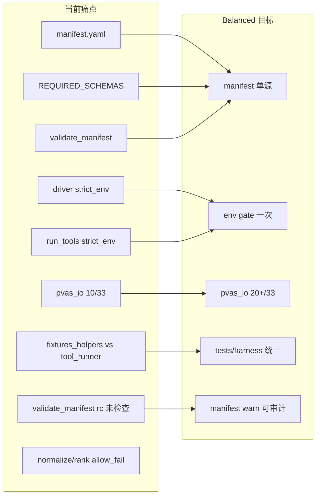

# PVAS Balanced 精简与优化设计

**状态：** 已批准 — Balanced 实施完成  
**日期：** 2026-06-30  
**版本基线：** `0.10.0-alpha10` + Phase 1 分层重构（`core/manifest.yaml`、`guides/`、`validate_intake` 等）  
**关联文档：**
- 原 Cursor plan：`.cursor/plans/pvas_simplify_balanced_4148ffad.plan.md`
- Phase 2 总 spec：[`2026-06-30-pvas-layered-refactor-design.md`](2026-06-30-pvas-layered-refactor-design.md)
- Phase 1 实施计划：[`../plans/2026-06-30-pvas-layered-refactor-phase1.md`](../plans/2026-06-30-pvas-layered-refactor-phase1.md)

---

## 1. 目的与边界

### 1.1 目的

在 Phase 1 落地后，对全仓库进行 **Balanced** 精简：消除重复门禁/注册表/测试 harness，推广已有共享模块（`pvas_io`、`report_render`、`budget_common`），并为 Phase 2 物理迁移与 gate 统一做 **前置对齐**。

### 1.2 与 Phase 2 的关系

| 维度 | Balanced 本轮 | Phase 2（另开 spec/plan） |
|------|---------------|---------------------------|
| 目录物理迁移 | 不做 | `schemas/` → `core/contracts/` 等 |
| manifest 单源 | **做**（逻辑层） | 随 `runtime/lib` 搬迁 |
| driver gate 表统一 | **部分**（可审计 warn、文档对齐） | `run_postflight.py` 消费 `stage-policies.yaml` |
| normalize/rank/packets fail-closed | **不纳入必做** | E5 完整实现 |
| Semgrep 策略 | 不做 | Phase 3 |

Balanced 是 Phase 2 的 **逻辑前置**，不是 Phase 2 替代品。

### 1.3 明确跳过

- 拆分 `generate_poc_testcase.py`（~1284 行）、`generate_final_report.py`（~803 行）
- README 707 行大瘦身
- `manifest_io.py` 换 PyYAML（与 stdlib-only 冲突）
- driver 单进程 library 化
- 38 adapter agent 文件 codegen
- `fetch_public_vuln_sources.py` 网络层整理

---

## 2. 现状痛点（审查确认）

**保留不动（已验证价值）：** `tools/pvas_io.py`、`tools/report_render.py`、`tools/strict_env_gate.py`、`tools/tool_catalog.py`、`adapters/codex/` 薄适配模式。

---

## 3. 原 plan 审阅结论

### 3.1 优点

- PR 切分合理，Track A/B/C/D 优先级清晰
- 与 Phase 1 交付物衔接自然（manifest、intake、exception-index）
- 跳过项明确，避免 scope creep
- 每 PR 以 `./run-tests.sh` 为门禁，符合项目惯例

### 3.2 需补充项（已纳入本 spec）

| # | 问题 | 处置 |
|---|------|------|
| R1 | **B7 合并 `validate_language_outputs.py`** 未列下游引用 | PR-5 必须同步：`test_bilingual_output.py`、`workflows/08-report.md`、`docs/runbooks/bilingual-output.md`、`REQUIRED_TOOLS` |
| R2 | **报告根路径双轨**（driver 写 `audit-output/` 根 vs workflow 示例 `06-report/`） | 合并 CJK 检查时 `validate_report_completeness` 接受 `--report-root` 与 driver 一致；workflow 文档注明双路径 |
| R3 | **验收标准 B1 过严**（「Phase 1 测试无内联 subprocess」）与 PR-2 只迁 5 个测试矛盾 | 改为：5 个 Phase 1 测试 + `test_workflow_gate_docs` 类不再新增内联 boilerplate |
| R4 | **PR-1 未含 `REQUIRED_TOOLS` 更新** | 新增 `pvas_env.py`、`budget_common.py` 时更新 `enforce_workflow_contract.py`；删除 `validate_language_outputs.py` 时 PR-5 移除 |
| R5 | **`validate_manifest` L79–80** driver 不检查 rc | PR-4：`write_step('00-manifest-validation', ...)` + `refresh_exception_index`；warn 写入 step 与 exception-index |
| R6 | **`stage-policies.yaml` 路径错误**（如 `00-intake/environment-check.json` 应为 `00-environment/`） | PR-6 按 spec §3.4 对照表逐项修正 |
| R7 | **C2 adapter `_shared` 引用** | 先验证 Claude Code / OpenCode 是否支持 markdown include；不支持则改为「生成时 copy 一段」或保留 8 行重复并文档说明 |
| R8 | **Phase 2 E5 未提及** | 记入 §6 跳过清单，并在 Phase 2 spec todo 交叉引用 |
| R9 | **`summarize_artifacts.py`** | 保持 skip；可选 PR-6 脚注：manifest `artifacts` 列表可作为未来索引源 |
| R10 | **版本号** | Balanced 完成后 `skill.json` patch bump（如 `0.10.0-alpha11`）+ `CHANGELOG.md` 一节 |

### 3.3 PR 顺序微调建议

原顺序 PR-1→6 基本合理。补充约束：

- **PR-4（manifest 单源）应在 PR-5（emit_gate_result）之前** — 已满足
- **PR-1 中 B4 触及 `make_ai_packets.py`** — Track D 的 `slice_file` 行窗口读可 **可选并入 PR-1 末尾**（同文件、低耦合、高收益）；若时间紧仍留 Track D

---

## 4. 设计方案

### Track A — P0 结构性去重

#### A1. Manifest / schema 注册表单源

**问题：** 三套并行 — `core/manifest.yaml`、`enforce_workflow_contract.REQUIRED_SCHEMAS`、`validate_manifest.py`。

**做法：**

1. `manifest_io.py` 增加 `crosscheck_schemas(manifest, extra_required: list[str]) -> tuple[list[str], list[str]]`（errors, warnings）
2. `enforce_workflow_contract` 删除 L78–97 独立交叉逻辑，改为调用 `validate_manifest.validate()` 并合并 warnings
3. `REQUIRED_SCHEMAS` 缩为「manifest 未注册但 CI 必需」最小补集，或完全由 manifest `artifacts` + `exception_aggregation.schema` 驱动
4. `test_schemas.py` / golden fixtures 仍保留 schema 文件存在性检查，不与 manifest 重复维护 **名称列表**

**Driver（PR-4）：** `validate_manifest` 调用后检查 rc；非零时 `write_step(..., status='failed'|'blocked', ...)` + `refresh_exception_index(out)`；默认不 block 全流程（与 Phase 1 warn 策略一致），但 machine 侧可审计。

**验收：** `test_manifest.py` + `enforce_workflow_contract.py --root .` 通过；新增 schema 只改 `core/manifest.yaml` + `schemas/` 文件。

#### A2. 消除双重 `strict_env_gate`

- `run_tools.sh` 支持 `PVAS_SKIP_ENV_GATE=1`
- `enforced_audit_driver.py` 调用 `run_tools.sh` 前 export
- standalone `run_tools.sh` 仍默认 gate
- **可选（PR-1）：** 文档注释说明 driver 已生成 matrix，`run_tools.sh` 内 regenerate 为 standalone 路径行为

**验收：** `test_driver_workflow_gates.py`、`test_tool_execution_gates.py` 通过。

#### A3. `stage-policies.yaml` 漂移

**Balanced 选 B：** 不接入 driver。

- 文件头：`status: aspirational-phase2`
- 修正路径：`tool-matrix.json` → `required-tools-matrix.json`；`00-environment/` 下 environment-check、tool-install-plan
- `step_id` 与 `guides/index.json`、driver `write_step` 一致
- Phase 2 spec §「Postflight 统一入口」保留 `run_postflight.py` todo

#### A4. 统一 `env_flag()`

新建 `tools/pvas_env.py`（推荐独立模块，避免 `pvas_io` 职责膨胀）：

- `env_flag(name: str, default: bool = False) -> bool`
- 供 `strict_env_gate.py`、`verify_environment.py`、`enforced_audit_driver.py` import

---

### Track B — P1 共享模块推广

#### B1. 合并测试 harness

1. 扩展 `tests/tool_runner.py`：`ROOT`, `run_subprocess(cwd=ROOT)`, `run_tool`, `temp_audit_dir`, `load_fixture`, `minimal_finding`
2. 删除 `tests/fixtures_helpers.py`，更新所有 import（当前至少 `test_manual_validation_plan.py`、`test_final_summary_gates.py`）
3. 迁移优先：`test_manifest.py`, `test_intake_gate.py`, `test_exception_index.py`, `test_report_completeness_enforced.py`, `test_rank_candidates.py`

**验收：** `./run-tests.sh` 全绿；上述 5 个测试无 `ROOT = pathlib.Path(...).parents[1]` 内联。

#### B2. `pvas_io` Top 8 迁移

| 文件 | 变更 |
|------|------|
| `enforced_audit_driver.py` | `write_json` / `load_json` / findings 辅助 |
| `generate_poc_testcase.py` | 去本地 `load_profile_json` |
| `validate_poc_artifacts.py` | I/O 统一 |
| `context_budget.py` | I/O 统一 |
| `strict_env_gate.py` | I/O 统一 |
| `rank_candidates.py`, `normalize_results.py` | I/O 统一 |
| `validate_intake.py` | result 写盘 `write_json` |

**验收：** `python3 -m py_compile tools/*.py`；相关测试通过；采用率 ≥ 20/33。

#### B3. `report_render` 去重

`publish_bilingual_reports.py`：删本地 `flatten_discovery`；统一 `finding_status()` / `discovery_summary_str()`。

#### B4. `budget_common.py`

~40 行：`est_tokens*` + `batch_packets()`，供 `make_ai_packets.py`、`context_budget.py` import。

#### B5. 共享 `sha256_file`

移入 `pvas_io.py`（首选，与文件 I/O 内聚）或 `hash_util.py`。

#### B6. `emit_gate_result`

`pvas_io.emit_gate_result(path, result)` — 统一 `{status, errors, warnings}` + mkdir + JSON；status 词汇表：`passed` / `failed` / `blocked`。

消费者：`enforce_workflow_contract`、`validate_manifest`、`validate_intake`、`context_budget`（PR-5，依赖 PR-3 pvas_io 迁移）。

#### B7. 合并 `validate_language_outputs.py`

- CJK 隔离检查并入 `validate_report_completeness.py`（optional，`--check-language-isolation`）
- 删除 `tools/validate_language_outputs.py`
- 更新：`REQUIRED_TOOLS`、`test_bilingual_output.py`（改调 completeness CLI）、`workflows/08-report.md`、`docs/runbooks/bilingual-output.md`
- **注意：** `validate_poc_artifacts.validate_language_variant` 为不同函数，保留命名，避免误删

---

### Track C — P2 文档与适配器

#### C1. `guides/index.json` CI

`run-tests.sh` 增加：`generate_guides_index.py` 输出到 temp + diff，或独立 `test_guides_index_fresh.py`。

#### C2. Adapter enforcement patch

新建 `adapters/_shared/enforcement-patch.md`；Claude Code / OpenCode command 引用。

**前置：** 确认平台是否支持 include；否则 defer 或 copy-on-install 脚本。

#### C3. 披露文档单源

`references/disclosure-policy.md` → 指向 `core/disclosure/`；`SKILL.md` 保留 3 行摘要 + 链接。

---

### Track D — 性能（可选 follow-up）

| 优先级 | 文件 | 优化 |
|--------|------|------|
| P1 | `make_ai_packets.slice_file` | 按行窗口读 |
| P1 | `correlate_public_vulns.py` | 索引未命中不回退全库 scan |
| P2 | `context_budget.py` | packet 无 index 时 size 粗估 |
| P2 | driver | budget 解析 stdout |

建议 Balanced 完成后单独 PR；PR-1 可选附带 `slice_file` 若改动 `make_ai_packets.py` 时已触达。

---

## 5. 实施顺序与 PR 切分

| PR | 内容 | 风险 |
|----|------|------|
| **PR-1** | A2 + A4 + B4 + B5 + REQUIRED_TOOLS 新增项 +（可选 slice_file） | 低 |
| **PR-2** | B1 harness + 5 测试迁移 | 低 |
| **PR-3** | B2 pvas_io Top 8 | 中 |
| **PR-4** | A1 manifest 单源 + driver manifest step 可审计 | 中 |
| **PR-5** | B3 + B6 + B7 + 文档/测试引用 | 中 |
| **PR-6** | A3 + C1 + C2（或 defer）+ C3 + CHANGELOG/skill.json patch | 低 |

每 PR 末尾：`./run-tests.sh`。

---

## 6. 验收标准（Balanced 完成定义）

- [ ] driver 路径无双重 `strict_env_gate`
- [ ] manifest schema 检查单源；contract 不维护独立 schema 名称列表
- [ ] `validate_manifest` 失败在 machine workflow-steps + exception-index 可审计
- [ ] `pvas_io` 采用率 ≥ 20/33 tools
- [ ] 测试 harness 单一模块；5 个 Phase 1 测试无内联 subprocess boilerplate
- [ ] `publish_bilingual_reports` 无重复 flatten
- [ ] `validate_language_outputs.py` 已删除且引用已迁移
- [ ] `stage-policies.yaml` 路径已修正并标注 phase2
- [ ] `guides/index.json` drift CI 通过
- [ ] `./run-tests.sh` 全绿
- [ ] `skill.json` / `CHANGELOG.md` 已记录 Balanced 变更

---

## 7. 跳过但记录在案（Full / Phase 2+）

- `generate_poc_testcase.py` / `generate_final_report.py` 拆分
- README 策略章节改链接
- driver 单进程 in-process gates
- **Phase 2 E5：** normalize/rank/packets `allow_fail=True` → blocked/recoverable（见 layered refactor spec §阶段 2）
- `summarize_artifacts.py` manifest-driven 索引
- `test_report_admission.py` 内联策略 → 测真实 gate
- Claude/OpenCode 38 agent codegen
- `fetch_public_vuln_sources.py` 半实现网络层
- `sys.path.insert(0, 'tools')` 全局清理（随 Phase 2 `runtime/lib`  Package 化一并处理）

---

## 8. 风险与缓解

| 风险 | 缓解 |
|------|------|
| manifest 单源后 CI 漏检新 schema | `crosscheck_schemas` 对 manifest 有而磁盘无的文件报 error |
| 删除 `validate_language_outputs` 漏改 workflow 文档 | PR-5 checklist 含 4 个引用路径 |
| adapter shared patch 平台不支持 include | C2 前置验证；不支持则 defer |
| PR-3/4 并行冲突 | 串行 PR-3 → PR-4；PR-4 不修改已迁 pvas_io 的 I/O 语义 |

---

## 9. 下一步

1. **用户审阅本 spec** — 确认补充项与 PR 顺序
2. 批准后 invoke **writing-plans** → `docs/superpowers/plans/2026-06-30-pvas-simplify-balanced.md`
3. 按 PR-1…6 执行；每步 `./run-tests.sh`
